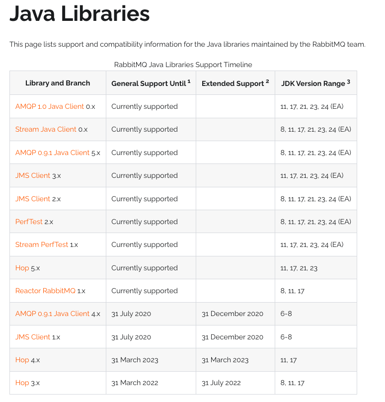
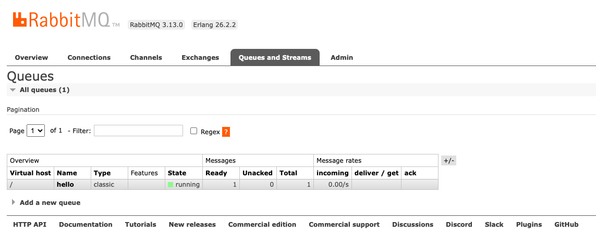
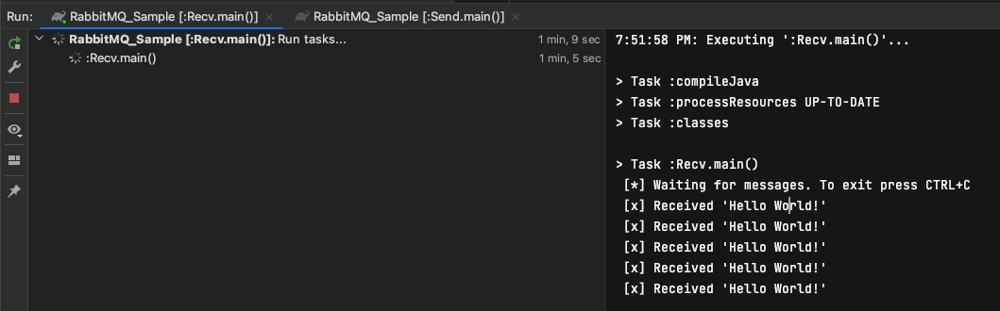
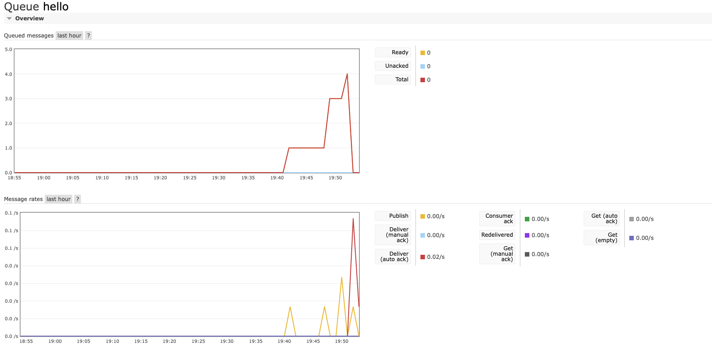

# 03. RabbitMQ Hello World (Java)
<div style="text-align:right">2024.10.17</div>

RabbitMQ 공식 문서를 따라해보자.
> https://www.rabbitmq.com/tutorials/tutorial-one-java

---

## Java에서 사용할 수 있는 RabbitMQ Libraries
- https://www.rabbitmq.com/client-libraries/java-versions


_솔직히.. 그냥 이거 쓰면 될 것 같다.__
- https://mvnrepository.com/artifact/com.rabbitmq/amqp-client
---

## Send.java
```java
import com.rabbitmq.client.Channel;
import com.rabbitmq.client.Connection;
import com.rabbitmq.client.ConnectionFactory;

import java.nio.charset.StandardCharsets;

public class Send {
    private final static String QUEUE_NAME = "hello";

    public static void main(String[] argv) throws Exception {
        ConnectionFactory factory = new ConnectionFactory();
        factory.setHost("localhost");
        try (Connection connection = factory.newConnection();
             Channel channel = connection.createChannel()) {
            channel.queueDeclare(QUEUE_NAME, false, false, false, null);
            String message = "Hello World!";
            channel.basicPublish("", QUEUE_NAME, null, message.getBytes(StandardCharsets.UTF_8));
            System.out.println(" [x] Sent '" + message + "'");
        }
    }
}
```

실제로 실행을 시켜보면, 아래와 같이 RabbitMQ 관리 페이지에서 나온다.


## Recv.java
```java
import com.rabbitmq.client.Channel;
import com.rabbitmq.client.Connection;
import com.rabbitmq.client.ConnectionFactory;
import com.rabbitmq.client.DeliverCallback;

import java.nio.charset.StandardCharsets;

/**
 * https://www.rabbitmq.com/tutorials/tutorial-one-java
 */
public class Recv {
  private final static String QUEUE_NAME = "hello";

  public static void main(String[] argv) throws Exception {
    ConnectionFactory factory = new ConnectionFactory();
    factory.setHost("localhost");
    Connection connection = factory.newConnection();
    Channel channel = connection.createChannel();

    channel.queueDeclare(QUEUE_NAME, false, false, false, null);
    System.out.println(" [*] Waiting for messages. To exit press CTRL+C");

    DeliverCallback deliverCallback = (consumerTag, delivery) -> {
      String message = new String(delivery.getBody(), StandardCharsets.UTF_8);
      System.out.println(" [x] Received '" + message + "'");
    };
    channel.basicConsume(QUEUE_NAME, true, deliverCallback, consumerTag -> { });
  }
}
```

----
## 실행
나는 jar 파일로 만들기도 귀찮고 해서, 직접 로컬에서 실행했다.


관리자 화면에서 보니 큐에서 빠진 것으로 보인다.



----

## 참고 : RabbitMQ Command
RabbitMQ에 어떤 큐가 있고 큐에 얼마나 많은 메시지가 있는지 보고 싶을 수 있다.
```sh
sudo rabbitmqctl list_queues
```

Windows에서는 sudo를 생략합니다.
```sh
rabbitmqctl.bat list_queues
```

__나는 path가 등록되어 있지 않아서 수동으로 등록해주었다.__
_아래 명령어로 rabbitmqctl이 존재하는지 확인하고, 없다면 path에 넣어주면 된다._
```sh
## rabbitmqctl 명령어 확인
find /usr/local -name rabbitmqctl

## PATH 확인
echo $PATH
```

profile, bash_profile을 사용해도 되지만, 
나는 그냥 path 파일에 추가를 하였다.
```
vi /etc/paths
```