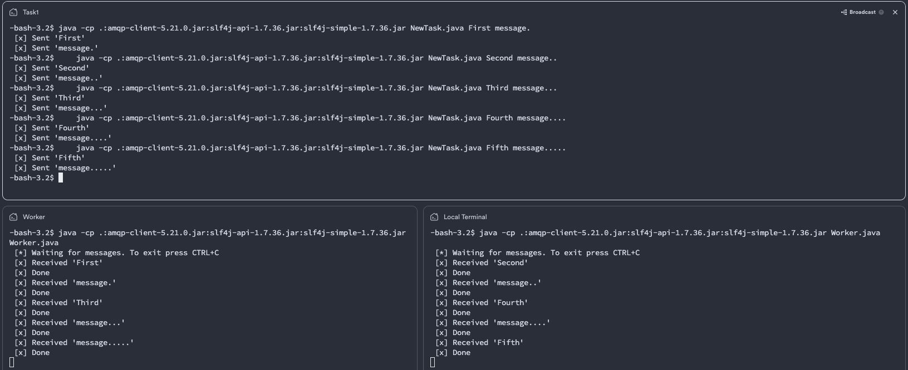

## RabbitMQ_Work_Queues (RabbitMQ 작업 대기열)
- https://www.rabbitmq.com/tutorials/tutorial-two-java

---
## 어떤 내용을 말하고 있는가?
해당 장에서는 자바 클라이언트를 사용하여, NewTask와 Work 클래스를 만들어
jar 파일로 실행을 시킨다.
그런데 이때 Worker 프로세스를 2개를 띄워서, 라운드로빈 기법과 같이
공정하게 분배가 되도록 처리를 하는 예시를 보여주고 있다.

---
## AutoAck
### 1. autoAck = true (자동 확인)
- 소비자가 메시지를 수신하면, RabbitMQ는 즉시 해당 메시지를 대기열에서 제거합니다.
- 메시지 처리에 실패하더라도 RabbitMQ는 이를 다시 전달하지 않으며, 메시지는 소실됩니다.
- 간단한 처리가 가능할 때 유용하지만, 메시지 손실에 민감한 애플리케이션에는 부적합합니다.
### 2. autoAck = false (수동 확인)
- 소비자는 명시적으로 basicAck를 호출하여 메시지가 성공적으로 처리되었음을 RabbitMQ에 알립니다.
- 메시지가 성공적으로 처리되지 않으면 basicNack 또는 basicReject를 호출할 수 있으며, 이 경우 RabbitMQ는 메시지를 다시 전송하거나 다른 소비자에게 재전송할 수 있습니다.
- 이 방식은 메시지의 신뢰성을 높이고, 메시지 손실을 방지합니다.

__보통 autoAck로 false로 하여, 장애나 미전송에 대해서 대비책을 가지고 가는 것이 좋아 보인다.__

아래는 rabbitmq 큐에 담겨 있는 메시지와, 전달대기중인 메시지, 그리고 ack 신호를 받지 못한 수를 
출력하는 명령어이다.
```sh
sudo rabbitmqctl list_queues name messages_ready messages_unacknowledged
```

---
## Fair dispatch
Fair dispatch (공정한 분배)라는 의미로, 2개의 Worker를 동시에 실행했을때
일(메시지)처리 분배가 공정하게 되지 않을 수가 있다.
즉, 바쁘지 않은 worker에게 작업을 주어, 대기열을 해소한다는 사상이다.
_(다만 모두가 바쁘다면, worker를 늘리거나 설계를 바꾸는 방법이 필요하다)_

```java
int prefetchCount = 1;
channel.basicQos(prefetchCount);
```


__이제 소스코드를 작성하여, 실행해보자.__

---
## NewTask.java
```java
import com.rabbitmq.client.Channel;
import com.rabbitmq.client.Connection;
import com.rabbitmq.client.ConnectionFactory;
import com.rabbitmq.client.MessageProperties;

import java.nio.charset.StandardCharsets;
import java.util.Arrays;

/**
 * Docs : https://www.rabbitmq.com/tutorials/tutorial-two-java
 * Command
    java -cp .:amqp-client-5.21.0.jar:slf4j-api-1.7.36.jar:slf4j-simple-1.7.36.jar NewTask.java First message.
    java -cp .:amqp-client-5.21.0.jar:slf4j-api-1.7.36.jar:slf4j-simple-1.7.36.jar NewTask.java Second message..
    java -cp .:amqp-client-5.21.0.jar:slf4j-api-1.7.36.jar:slf4j-simple-1.7.36.jar NewTask.java Third message...
    java -cp .:amqp-client-5.21.0.jar:slf4j-api-1.7.36.jar:slf4j-simple-1.7.36.jar NewTask.java Fourth message....
    java -cp .:amqp-client-5.21.0.jar:slf4j-api-1.7.36.jar:slf4j-simple-1.7.36.jar NewTask.java Fifth message.....
 */
public class NewTask {

    private static final String TASK_QUEUE_NAME = "task_queue";
//    private static final String[] ARGV = {
//            "First message.",
//            "Second message..",
//            "Third message...",
//            "Fourth message....",
//            "Fifth message....."
//    };

    public static void main(String[] argv) throws Exception {
        // hard setting
        //argv = ARGV;

        ConnectionFactory factory = new ConnectionFactory();
        factory.setHost("localhost");
        try (Connection connection = factory.newConnection();
             Channel channel = connection.createChannel()) {
            for(String arg : argv){
                channel.queueDeclare(TASK_QUEUE_NAME, true, false, false, null);
                String message = String.join(" ", arg);
                channel.basicPublish("", TASK_QUEUE_NAME,
                        MessageProperties.PERSISTENT_TEXT_PLAIN,
                        message.getBytes(StandardCharsets.UTF_8));
                System.out.println(" [x] Sent '" + message + "'");
            }
        }
    }

}
```

---
## Woker.java
```java
import com.rabbitmq.client.Channel;
import com.rabbitmq.client.Connection;
import com.rabbitmq.client.ConnectionFactory;
import com.rabbitmq.client.DeliverCallback;

import java.nio.charset.StandardCharsets;

/**
 * Docs : https://www.rabbitmq.com/tutorials/tutorial-two-java
 * Command : java -cp .:amqp-client-5.21.0.jar:slf4j-api-1.7.36.jar:slf4j-simple-1.7.36.jar Worker.java
 */
public class Worker {

    private static final String TASK_QUEUE_NAME = "task_queue";

    public static void main(String[] argv) throws Exception {
        ConnectionFactory factory = new ConnectionFactory();
        factory.setHost("localhost");
        final Connection connection = factory.newConnection();
        final Channel channel = connection.createChannel();

        channel.queueDeclare(TASK_QUEUE_NAME, true, false, false, null);
        System.out.println(" [*] Waiting for messages. To exit press CTRL+C");

        channel.basicQos(1);

        DeliverCallback deliverCallback = (consumerTag, delivery) -> {
            String message = new String(delivery.getBody(), StandardCharsets.UTF_8);

            System.out.println(" [x] Received '" + message + "'");
            try {
                doWork(message);
            } finally {
                System.out.println(" [x] Done");
                channel.basicAck(delivery.getEnvelope().getDeliveryTag(), false);
            }
        };
        channel.basicConsume(TASK_QUEUE_NAME, false, deliverCallback, consumerTag -> { });
    }

    private static void doWork(String task) {
        for (char ch : task.toCharArray()) {
            if (ch == '.') {
                try {
                    Thread.sleep(1000);
                } catch (InterruptedException _ignored) {
                    Thread.currentThread().interrupt();
                }
            }
        }
    }
}
```

---
## Exceute
이제 위에 작성된 부분의 주석을 참고하여,
아래 명령어를 통해서 실행을 시켜보자.
(동일한 위치에 .jar 파일 3개를 두었다)
```sh
## Worker 프로세스 1개 실행 (1)
java -cp .:amqp-client-5.21.0.jar:slf4j-api-1.7.36.jar:slf4j-simple-1.7.36.jar Worker.java
## Worker 프로세스 1개 더 실행 (2)
java -cp .:amqp-client-5.21.0.jar:slf4j-api-1.7.36.jar:slf4j-simple-1.7.36.jar Worker.java
## NewTask를 통해서, 신규 메시지 발행 처리
java -cp .:amqp-client-5.21.0.jar:slf4j-api-1.7.36.jar:slf4j-simple-1.7.36.jar NewTask.java First message.
java -cp .:amqp-client-5.21.0.jar:slf4j-api-1.7.36.jar:slf4j-simple-1.7.36.jar NewTask.java Second message..
java -cp .:amqp-client-5.21.0.jar:slf4j-api-1.7.36.jar:slf4j-simple-1.7.36.jar NewTask.java Third message...
java -cp .:amqp-client-5.21.0.jar:slf4j-api-1.7.36.jar:slf4j-simple-1.7.36.jar NewTask.java Fourth message....
java -cp .:amqp-client-5.21.0.jar:slf4j-api-1.7.36.jar:slf4j-simple-1.7.36.jar NewTask.java Fifth message.....
```

---
## Round-Robin(RR) dispatching

적절하게 분배를 하여, 라운드로빈 방식으로 작동이 되고 있다.
