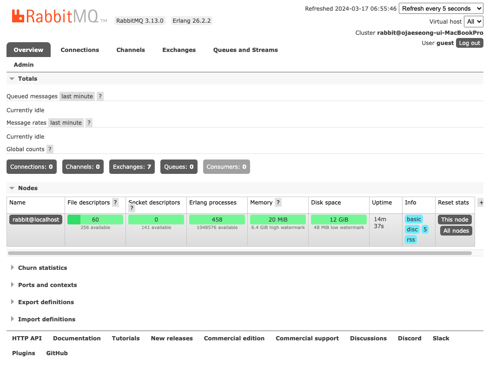

## RadditMQ 설치
<div style="text-align:right">2024.03.17</div>

---
## 설정환경
저의 경우에는 macOS로 로컬셋팅을 하였습니다.
어느정도 익숙해지고 Docker나 Cloud 환경에서 작업을 할 계획입니다.

---
## RabbitMQ Install
> __참고__
> https://www.rabbitmq.com/docs/install-homebrew

```bash
## Installation
brew update
brew install rabbitmq

## Location
brew info rabbitmq

## Start RabbitMQ Node
brew services start rabbitmq

## Stop RabbitMQ Node
brew services stop rabbitmq
```

---
## RabbitMQ Test
http://localhost:15672
접속해보자. (게정은 guest / guest이다)
정상적으로 뜬다면 설치 이후 기동이 완료된 것이다.

