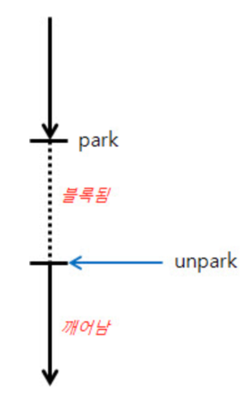

## Thread를 메모리 관점에서 생각해보자
우리가 보통 Thread를 사용하면서 메모리에 대한 이슈를 고민을 하지만 생각보다 큰 이슈로 이어지지는 않는다. (참고로 API 요청 1회도 하나의 Thraed를 사용함)
어떤 메커니즘을 통해서 Thread가 동작하기에 가능할지에 대해서 궁금했다.

## LockSupport 라이브러리 탄생
당시 자바 기술적으로는 synchronized 도구 없이는, Thread를 임의로 block 시키고 다른 작업을 수행할 수가 없었다.
> 참고)
> Thread.suspend와 Thread.resume은 deprecated 된 것이므로 사용하지 말아야 한다.

이에 java.1.5에서는 Concurrent Package에는 이를 위한 도구가 마련되었는데 바로 "java.util.concurrent.locks.LockSupport"이다.

자바의 Lock-Free가 탄생된 배경이다.

## java.util.concurrent.locks.LockSupport

## 참고
- Lock-Based, Lock-Free, Wait-Free Program
- java doc : https://docs.oracle.com/javase/6/docs/api/java/util/concurrent/locks/LockSupport.html
