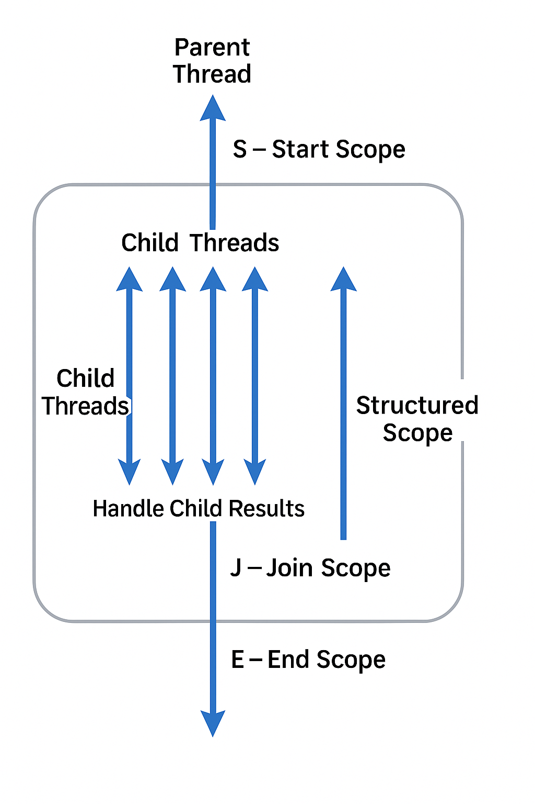

## StructuredTaskScope and Subtask
- 구조화된 작업 범위와 하위 작업에 대해서 설명하는 장이였다.

---
### 구조에 대한 그림


---
### 샘플 코드
```java
import java.util.concurrent.StructuredTaskScope;
import java.util.concurrent.StructuredTaskScope.Subtask;
import java.util.concurrent.StructuredTaskScope.ShutdownOnFailure;

public class StructuredConcurrencySample {

    public static void main(String[] args) throws InterruptedException {

        ///////////////////////////////////////
        // S - Start Point
        ///////////////////////////////////////
        try (var scope = new StructuredTaskScope<TaskResponse>()) {

            ///////////////////////////////////////
            // Structured Scope - Start Point
            ///////////////////////////////////////
            var expTask = new LongRunningTask("expedia-task", 3, "100$", true);
            var hotTask = new LongRunningTask("hotwire-task", 10, "110$", true);

            // Start running the tasks in parallel
            Subtask<TaskResponse> expSubTask = scope.fork(expTask);
            Subtask<TaskResponse> hotSubTask = scope.fork(hotTask);

            // Wait for all tasks to complete (success or not)
            scope.join();

            // Handle Child Task Results (might have succeeded or failed)
            var expState = expSubTask.state();
            if (expState == StructuredTaskScope.Subtask.State.SUCCESS) {
                System.out.println(expSubTask.get());
            }
            else if (expState == StructuredTaskScope.Subtask.State.FAILED) {
                System.out.println("Expedia task failed: " + expSubTask.exception());
            }

            var hotState = hotSubTask.state();
            if (hotState == StructuredTaskScope.Subtask.State.SUCCESS) {
                System.out.println(hotSubTask.get());
            }
            else if (hotState == StructuredTaskScope.Subtask.State.FAILED) {
                System.out.println("Hotwire task failed: " + hotSubTask.exception());
            }
            ///////////////////////////////////////
            // Structured Scope - End Point
            ///////////////////////////////////////
        }
        ///////////////////////////////////////
        // E - End Point
        ///////////////////////////////////////
    }
}

```