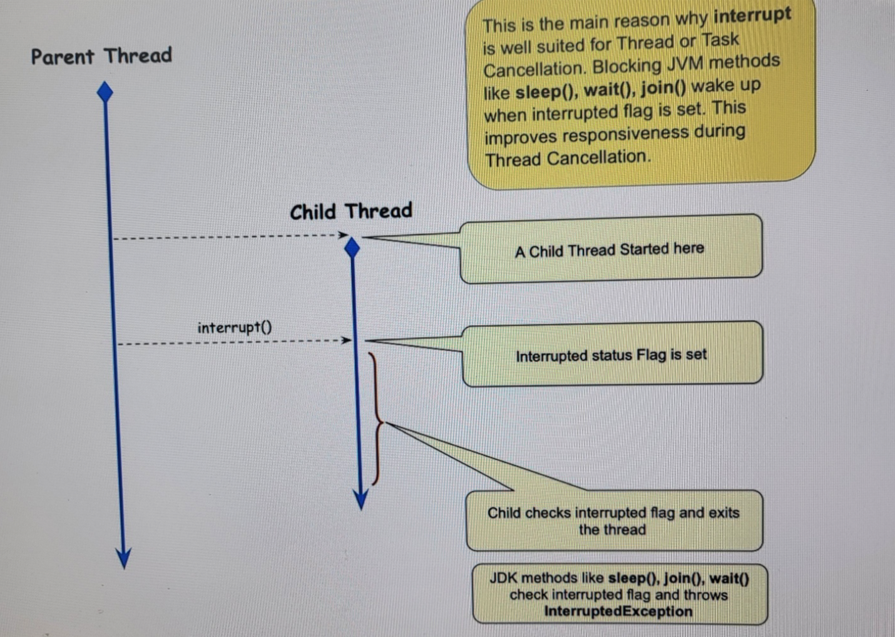

# Thread Cancellation
인트로에서 제기된 이슈를 해결하기 위해서는 여러가지 방법이 있다.


## Method in Thread class
첫번째는 쓰레드에 interrupt 시그널을 주어 정지를 명령하는 것이다.

### Code
```java
// Set the 'interrupted' status flag for a thread to TRUE
public void interrupt()

// Checks thre 'interrupted' status flag and if TRUE - clears it
public static boolean interrupted()

// Checks the 'interrupted' status flag but does not clear it
public boolean isInterrupted()
```

### Diagram


### Summary
- Interruptor must call interupt() to set the flag
- Interrupted Thread must
    - May choose to ignore the interrupt
    - Check interrupted status periodcally
    - JDK Methods like wait(), slepp(), join() will check status automatically
        - Throws InterruptedException
        - Clear the interrupted status flag 

----
## Cooperative Mechanism


---
## Both Platform Threads and Virtual Threads